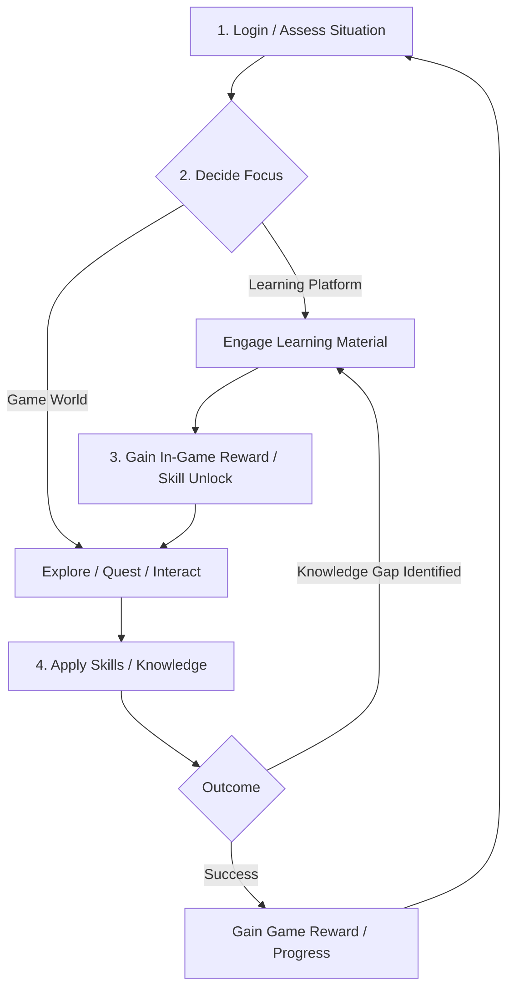

# Project Overview

> **Layer: the game.** This doc describes the essential experience of
> *Saxonberg* — the educational game built on the platform: "learning
> as adventure." It is **education at its core**, by design. The
> **platform** underneath is a vertical-agnostic gamification engine
> with its own, abstract essence; for that, see
> design-philosophy.md,
> interaction-philosophy.md, and
> standard-model.md. The two layers are nested,
> not in tension — reconciled in
> lenses/essential-experience.md.

Saxonberg transforms the pursuit of knowledge into an immersive multiplayer role-playing experience, set within a richly simulated **virtual university environment**. More than just a collection of online course pages, Saxonberg recreates the broader **university experience** – the bustling campus, diverse locations, social interactions, and academic challenges – as the core **narrative** framework. It's a web-based game world deeply interwoven with a dynamic adaptive learning platform, crafting a compelling journey where academic achievement and engaging gameplay fuel one another. Inspired by the interactive depth of text-based MUDs, Saxonberg establishes a unique synergy: mastery of learning platform content unlocks character abilities and drives the personal story forward within this academic setting, while in-game exploration and collaboration provide rich context and motivation for learning, ultimately fostering superior educational **outcomes**.

**The Saxonberg Experience:**

- **Learning as Adventure (Outcome-Focused Gamification & Alignment):** Within the Saxonberg university setting, academic progress becomes the engine of adventure. As students delve into the learning platform's subject taxonomy – mastering courses, chapters, exams, and projects – they don't just gain knowledge; they specialize. This specialization directly translates into unique in-game skills and roles, forming the basis of Saxonberg's class system. For example, a biology student might gain the ability to identify rare herbs found on campus grounds or in the surrounding wilderness, while a chemistry student learns to brew potent potions from them in the campus labs, and an economics student might excel at managing the resulting trade in the student union. This tight **alignment** between academic focus and in-game capability ensures that gameplay directly reinforces learning goals and encourages meaningful, collaborative role-play within the university narrative.
- **A World Woven from Words (Text-Centric Foundation):** Saxonberg embraces the evocative power of text. The university campus, its surrounding city, and wilderness biomes are brought to life through detailed prose, navigated via a powerful command-line interface (CLI). This foundation ensures every object, character, and event has a clear textual representation, promoting accessibility and deep, imaginative interaction.
- **Bridging Text and Web (Enhanced Interface & Social Tools):** While text is core, the web interface makes Saxonberg intuitive and socially vibrant.
  - **Accessible Controls:** Simplified web forms for common actions ease newcomers into the world, complementing the full depth of the CLI for veterans.
  - **Visual Enhancements:** Graphical aids clarify complex information, from campus maps to the effects of a complex spell during a simulated magical duel practice.
  - **Rich Media & Communication:** The interface seamlessly blends the text console with AI-generated illustrations, embedded educational videos, and live-streamed interactive sessions (like virtual office hours or guest lectures). A robust **emote system** further enhances social interaction, allowing nuanced expression between players and even with AI characters across campus.
- **A Living Academic World (AI-Powered Simulation):** The Saxonberg campus is a dynamic environment populated by AI-driven faculty, staff, and students. These characters create opportunities for simulated study groups, mentorship, research collaborations, and authentic social interactions, enriching the learning experience beyond traditional online platforms. The goal is a believable simulation of university life, complete with its routines, events, and hidden mysteries.
- **Stepping into Roles (Diverse Player Paths):** Player journeys primarily follow the student path within the university structure, but the specialization system allows for more. An aspiring teacher, having mastered relevant coursework, might lead AI student tutorials in a virtual classroom, gaining practical experience aligned with their real-world goals. The game provides avenues to embody roles directly related to academic pursuits and careers.
- **An Evolving World (Live Service & Community):** Saxonberg is envisioned as a **live-service** game, designed for continuous growth and evolution within its university setting and beyond. Initial features like customizable dorm rooms are just the beginning, paving the way for future player content creation through planned CMS and modding tools. Foundational to this vision is a commitment to fostering organic community **governance**, ensuring players and other stakeholders have a voice in the game's future development and direction.

Saxonberg aims to pioneer a new form of educational technology where deep engagement and effective learning are inseparable within a compelling, simulated university world. This document outlines the foundational vision for this evolving platform.

## User Interface & User Experience (UI/UX)

Saxonberg's UI/UX philosophy centers on balancing the depth and power of a traditional text-based Command Line Interface (CLI) with the accessibility and visual richness of a modern web application. This dual approach caters to both veteran MUD players and newcomers unfamiliar with purely text-driven worlds.

**Web Interface Layout & Aesthetic:**

The overall visual structure draws inspiration from familiar multi-panel layouts seen on live-streaming platforms, but is fundamentally adapted to prioritize text interaction.

- **Text Console Dominance:** Unlike video-centric sites, Saxonberg's largest and most central panel is dedicated to the text console output. This area serves as the heart of the interface, displaying a chronological timeline of the game world – descriptions, actions, dialogue, combat, and system messages. Its prominence reinforces the game's text-first foundation, leveraging the fact that every game element, event, and property possesses a canonical text representation.
- **Command Input:** Integrated closely with the output, the command input line allows players to type their commands directly.
- **Contextual Side Panels:** Surrounding the main console are configurable panels providing vital information and shortcuts:
  - Character Status (health, resources, effects)
  - Mini-Map / Location Information
  - Quest/Objective Tracker
  - Contextual Action Forms (see below)
  - Rich Media Display (for AI illustrations, videos)
  - Communication Hub (chat channels, emotes)
- **Responsive Design & Flexibility:** The layout is designed to be responsive, adapting to desktop, tablet, and mobile screen sizes. Users will have flexibility in arranging, resizing, or hiding panels, akin to a customizable dashboard or window manager, ensuring a comfortable experience across devices.
- **"Storybook" Aesthetic:** The visual design aims for a warm, "storybook" feel, moving away from colder, purely functional aesthetics. AI-generated or user-submitted graphics will illustrate text descriptions, enhancing immersion.

**Command Line Interface (CLI):**

The CLI remains the most powerful and expressive way to interact with Saxonberg, particularly for experienced users.

- **Unified Parser:** A sophisticated, unified command parser forms the backbone of interaction. It uses a familiar Unix-like syntax (`command -opt --longopt arg1 arg2...`) including support for subcommands (`command subcommand -subopt...`).
- **MVC-Inspired Model & Command Specification:** The parser design is inspired by Model-View-Controller principles. Command specifications, defined in YAML, map options and arguments to fields within a data model. This abstraction allows for features like piping command models and robust argument handling (e.g., `say Hello world.`). These specifications are central to system consistency, driving both the dynamic web forms (see below) and the automated generation of the in-game help system (providing both inline usage and detailed pages).
- **Extensibility (Future):** This model-based approach is designed for future expansion, notably the integration of a Natural Language Processing (NLP) layer that can parse conversational commands and map them to the same underlying command models, making Unix-style and natural language commands interchangeable.
- **Advanced Shell Features (Future):** Long-term plans include Zsh-like command completion, aliases and history, alongside a high-level scripting language enabling players and developers to automate complex actions or create custom macros. The initial implementation will focus on the core Unix-like parser with potential influences from PowerShell.

**Web Enhancements for Accessibility:**

To make the game approachable for everyone, the web interface provides crucial enhancements:

- **Contextual Web Forms (Command-Driven):** For common or complex actions (e.g., movement, basic interactions, crafting), intuitive web forms will be available in the side panels. Crucially, these forms dynamically generate the corresponding command string based on the underlying command specification when submitted. This ensures that even UI-driven interactions ultimately resolve to the same command system used by the CLI, reinforcing the command as the primary unit of interaction, maintaining consistency across user experience levels, and adhering to the text-first philosophy. These forms serve as essential shortcuts, lowering the barrier to entry for new players.
- **Visual Aids:** Graphical elements like maps, status bars, and diagrams supplement text descriptions where visualization adds significant clarity.
- **Rich Media Integration:** Panels can seamlessly display AI-generated illustrations tied to the current scene. Video integration supports multiple modes: embedding pre-recorded educational content from the learning platform (often integrated into quests or curricula) and facilitating live-streaming sessions. Live streams can be peer-to-peer (e.g., for private tutoring between trusted players) or broadcast (e.g., for player-run lectures), augmented by integrated text chat channels.

**Balancing Power and Approachability:**

The UI/UX design explicitly supports two modes of interaction: the deep, efficient CLI favored by power users, and the more guided, visually supported web interface elements designed for approachability and ease of learning. Players can fluidly mix both methods as they become more comfortable with the game's systems.

## Gamification Mechanics & Educational Alignment

The core principle of Saxonberg's design is a deep, **bidirectional alignment** between the adaptive learning platform and the game world. The primary goal is not merely to add game elements to learning, but to create a synergistic system where gameplay actively enhances and motivates academic engagement, leading to demonstrably better educational outcomes.

**Dual Advancement Pathways:**

Player progression unfolds along two interconnected pathways:

1.  **Academic Achievement:** Successfully completing milestones within the adaptive learning platform – mastering topics, passing quizzes and exams, finishing projects – directly translates into tangible character advancement within Saxonberg. This provides clear, immediate rewards for learning efforts.
2.  **Roleplaying & Gameplay:** Saxonberg also features traditional role-playing game mechanics. Players gain experience and progress through engaging in quests, exploring the virtual university and its surroundings, interacting with AI and other players, and participating in simulated challenges (like practice debates or lab experiments). A strong emphasis is placed on encouraging players to _roleplay_ their academic pursuits and goals within the game's narrative context.

**Synergistic Feedback Loop & Incentive Tuning:**

The connection between learning and gameplay is designed to be dynamic and mutually reinforcing:

- **Learning Unlocks Potential:** Progress on the learning platform unlocks corresponding skills, abilities, crafting recipes, access to specialized areas (e.g., advanced research labs), and narrative opportunities within the game.
- **Gameplay Informs Learning:** Player choices, actions, and demonstrated expertise within the game (e.g., consistently succeeding at chemistry-related challenges) can provide valuable feedback to the adaptive learning platform. This data can help refine the student's learning path, highlighting areas of natural aptitude or suggesting topics aligned with their in-game interests.
- **Targeted Motivation:** The game can dynamically generate quests, challenges, or narrative arcs specifically designed to incentivize engagement with learning materials the student may be struggling with or avoiding. By framing difficult topics within compelling gameplay scenarios and offering desirable in-game rewards, Saxonberg aims to help students overcome learning barriers.

**Academic Guilds (Class System):**

Instead of traditional fantasy classes, Saxonberg utilizes a system of **Guilds**, modeled after historical occupational unions and closely aligned with the learning platform's subject taxonomy.

- **Specialization:** Mastering specific academic subjects grants membership and advancement within corresponding Guilds (e.g., Biology Guild, Literature Guild, Computer Science Guild).
- **Skills & Roles:** Guild progression unlocks unique skills, abilities, and potential roles relevant to that field of study (e.g., a high-ranking Chemistry Guild member might be adept at potion-making or analyzing substances).
- **Interdisciplinary Study:** The system allows for multi-Guild membership, reflecting and rewarding students pursuing interdisciplinary studies on the learning platform.

**Narrative Integration & Milestones:**

Major academic milestones achieved on the learning platform (e.g., passing a final exam, completing a major project, earning a certification, graduation) are recognized within the game through significant quests, unique events, ceremonies, or other narrative acknowledgments, reinforcing the importance of these achievements.

**Academic Houses (Tentative):**

To foster community identity tied to real-world connections, Saxonberg may incorporate a system of **Academic Houses**. Inspired by collegiate Greek life (like fraternities and sororities) but designed to be inclusive of all genders, this system would serve primarily social functions. It provides a way to represent and abstract players' real-world learning institution affiliations within the game, potentially grouping smaller institutions into larger Houses. These Houses could provide shared social spaces (dedicated dorms, lounges), communication channels, and a basis for friendly connections or light-hearted rivalries, enhancing the university theme without significantly impacting core game mechanics.

**Standard Gamification Elements:**

While the deep alignment is core, Saxonberg will also incorporate familiar gamification elements such as achievement tracking, badges for accomplishments, and leaderboards to provide additional layers of motivation and progress visualization.

## Narrative Framework & World Design

Saxonberg's narrative and world are designed to immerse players in a vibrant, dynamic recreation of the university experience, serving as the primary stage for both academic pursuits and compelling role-playing stories.

**The Saxonberg Campus: A Living Setting**

The university campus is the students' hub and home base — but it is a small part of a much larger world. It's where the academic learning happens: a bustling environment of diverse locations, each offering discovery, interaction, and narrative hooks aligned with academic themes. Imagine:

- **The Grand Library:** Stacks filled with lore, hidden study carrels containing forgotten research notes, collaborative projects unfolding in group study rooms, perhaps even mysteries lurking in restricted archives accessible only through specific knowledge or Guild affiliation.
- **Departmental Halls:** Each academic discipline (Biology, History, Engineering, Arts, etc.) housed in its own distinct building, featuring specialized labs, workshops, lecture halls, and faculty offices. These areas serve as hubs for Guild activities, quests related to specific subjects, and interactions with AI professors or student peers.
- **Student Union & Cafeteria:** Social hubs for casual interaction, club meetings, trading player-crafted goods (like those chemistry potions!), or picking up campus gossip that might lead to new adventures.
- **Dormitories:** Customizable personal spaces for players, potentially organized by real-world institutional affiliation (see Factions), fostering smaller communities within the larger campus.
- **Athletic Fields & Arts Complex:** Areas for simulated extracurricular activities, competitions, performances, or quests related to physical education, strategy, or creative expression.
- **Hidden Corners:** Overgrown botanical gardens used for Biology fieldwork, mysterious tunnels beneath the old quad, observatory rooftops perfect for Astronomy Guild gatherings – countless opportunities for exploration and environmental storytelling.

Narratives emerge organically from this setting, focusing on academic challenges, research breakthroughs, social dynamics, institutional politics, collaborative projects, and the personal journey of intellectual growth.

**The Wider World: Where Learning Is Applied**

Beyond the campus lies the larger world – a surrounding city and diverse wilderness biomes (forests, deserts, mountains, coasts, etc., indoor and outdoor). This is where most of the world lives, and where students *apply* what they learn: the campus teaches the craft; the world beyond is where they wield it, on quests with real stakes. The build starts with the campus and expands outward, with the development and narrative direction of these external areas significantly shaped by player actions and community over time.

**Foundations of the World:**

Several key systems underpin the narrative and world simulation:

- **The Standard Model:** Analogous to a traditional MUD's library (mudlib), the Standard Model provides a flexible, comprehensive, and well-documented object-oriented class hierarchy for all diegetic game elements. Built upon a base `Stuff` class, it branches into core types like `Thing` (inanimate objects), `Location` (rooms/areas), `Agent` (players/NPCs), and `Idea` (abstract concepts), with extensive use of mixins allowing developers to easily combine features and create rich, interactive world components.
- **Dialogue System:** Interactions with AI characters will utilize a hybrid approach, combining traditional branching conversation trees for structured quests and information delivery with the potential for Large Language Model (LLM) integration in the future to enable more dynamic, naturalistic conversations.
- **Sensory Messaging:** To enhance immersion, the underlying communication protocol tags messages with sensory information (sight, sound, smell, touch, taste, and even extrasensory/system information) and contextual topics (e.g., environmental sounds, chat channels). This allows the interface to present the world in a richer, more evocative manner, reinforcing the player's sense of presence.

The narrative framework aims to create a world where story, character, setting, and style all serve the core theme of academic exploration and achievement, supported by robust systems that allow for both curated experiences and emergent player-driven narratives.

## Core Gameplay Loop

The core gameplay loop in Saxonberg is a fluid cycle designed around player agency, seamlessly integrating academic engagement with immersive role-playing within the virtual university setting. It encourages players to continuously balance and connect their learning objectives with their in-game actions.

**The Cycle of Play:**

1.  **Orientation & Decision:** Upon logging in, the player assesses their current situation: location on campus, active quests, character status, outstanding notifications, and perhaps suggested goals from the adaptive learning platform. Based on this context, the player decides their immediate focus – whether to engage directly with learning materials or pursue an in-game objective.
2.  **Engagement (Two Paths):**
    - **Path A: Learning Platform Focus:** The player directly interacts with the adaptive learning platform (potentially accessed via an in-game interface). This involves studying materials, taking quizzes/exams, or working on projects. Success here leads directly to step 3.
    - **Path B: Game World Focus:** The player interacts with the Saxonberg world – exploring the campus, talking to AI characters or other players, undertaking quests, crafting items, or participating in simulated activities. This often involves applying existing knowledge and skills. Actions here lead to step 4.
3.  **Academic Reward & Integration:** Successfully completing learning tasks (Path A) grants tangible in-game rewards: unlocking new skills relevant to the subject matter, advancing in academic Guilds, gaining resources, or fulfilling prerequisites for specific quests or game features. This immediately integrates the learning achievement back into the game world, often opening up new possibilities for Path B.
4.  **Gameplay Application & Outcome:** Engaging with the game world (Path B) allows players to apply their academically-derived skills and knowledge. Success in quests or challenges yields traditional game rewards (experience points, items, narrative progression). Crucially, gameplay might also reveal knowledge gaps or present obstacles that can only be overcome by acquiring specific knowledge, naturally guiding the player back towards Path A (Learning Platform Focus).
5.  **Re-assessment:** Following either path, the player reaches a new state – having gained knowledge, skills, items, or quest progress. This prompts a return to step 1 (Orientation & Decision) to determine the next course of action, continuing the cycle.

**Visualizing the Loop:**

This loop ensures that learning and playing are not separate activities but deeply intertwined components of a single, rewarding experience, constantly reinforcing each other to drive both educational progress and engaging gameplay.

## Character System & Progression

Character progression in Saxonberg reflects the game's unique blend of academic achievement and role-playing adventure. Players develop their capabilities through a combination of mastering learning platform content and engaging with the game world.

**Core Attributes (Tentative):**

To provide a familiar foundation, the initial design anticipates using a set of traditional core attributes (e.g., Strength, Dexterity, Constitution, Intelligence, Wisdom, Charisma). These would influence standard actions, skill checks, and resilience. However, the final attribute system remains flexible and may be adapted or replaced if alternative mechanics better serve the core gameplay and advancement goals as development progresses. If used, attribute increases would likely be tied primarily to gaining levels through gameplay experience.

**Skills - The Application of Knowledge:**

Skills represent specific, applicable capabilities learned by the character, serving as the primary mechanism aligning academic purpose with character advancement. Skill acquisition and improvement are heavily tied to **academic progress** on the learning platform and advancement within **Academic Guilds**. The specifics of skill granularity and specialization are subject to refinement, but the core function is to translate learning into tangible in-game competency. Skills can range from theoretical knowledge application (e.g., "Historical Analysis," understanding logical fallacies) to practical execution (e.g., "Field Botany," applying first aid, programming a simple routine). These skills form the foundation for interacting effectively with the game's challenges.

**Applying Knowledge: Quests & Challenges:**

Learned knowledge and acquired skills are put into practice through two primary avenues:

- **The Quest System:** Quests serve as the game's mechanism for delivering structured, multi-step learning narratives, often analogous to an academic curriculum. They guide players through complex topics, potentially requiring interdisciplinary knowledge and the application of multiple skills to progress through the narrative stages and achieve learning objectives.
- **Inline Gameplay Challenges:** Beyond formal quests, players will encounter emergent situations and problems within the game world where applying their knowledge provides a direct advantage or is necessary to overcome an obstacle. This could range from using trigonometric principles to gain a tactical advantage in a simulated conflict, to collaborating with other players using diverse skills (e.g., engineering, physics, resource management) to repair a broken bridge or solve an environmental puzzle.

**Academic Guilds - Specialization:**

As detailed previously, Guilds form the core of character specialization, directly mirroring the subject taxonomy of the learning platform and representing occupational paths. Joining and advancing within Guilds (e.g., Biology Guild, Engineering Guild, Philosophy Guild) unlocks access to relevant skills, specialized equipment, unique roles, and narrative opportunities tied to that field of study. Players can pursue multiple Guild affiliations, reflecting interdisciplinary learning paths. It's important to note that Guilds represent academic/professional alignment, not player-run social organizations.

**Dual Progression Path:**

Character advancement follows two interconnected streams:

1.  **Academic Mastery:** Progress on the learning platform and within Guilds unlocks _potential_ – granting access to new skills, higher ranks, and specialized knowledge. This is the primary driver for capability expansion.
2.  **Gameplay Experience:** Engaging in quests, exploration, social interaction, and overcoming challenges grants experience points (XP), leading to character levels. The specifics of the XP system (e.g., general vs. subject-specific) and the exact benefits of leveling are still under design, but will likely follow established RPG patterns, potentially increasing core attributes (if used) and general resilience, allowing the character to better _realize_ the potential unlocked through their studies.

**Supporting Character Elements:**

While core progression centers on academic alignment via Guilds and skills, several other elements contribute to character identity and capability:

- **Universal Magic:** Magic is envisioned not as a class-specific ability, but a fundamental force accessible to all specializations. Skills and equipment may allow characters to interact with or utilize magic in ways relevant to their academic field, rather than conforming to traditional "spellcaster" archetypes.
- **Organizational Affiliation (e.g., "Corporations"):** Distinct from academic Guilds and social Academic Houses, players might align with larger, purely fictional in-game **Organizations** (the name "Corporations" is tentative). These entities are envisioned as mechanics-driven factions that compete with each other, potentially sponsoring Guild Halls or shops, and might be tied to RPG alignment systems (Good/Evil, etc.). Affiliation would likely impact gameplay, progression, and large-scale world dynamics, offering a layer of strategic choice and conflict, entirely separate from real-world entities or academic pursuits.
- **Equipment:** Serves functional roles (tools for skills), cosmetic customization, and may offer bonuses potentially favoring physical or magical applications, supporting the character's chosen path.
- **Appearance Customization:** Standard options for personalizing character appearance will be available.

## Social Systems & Community Interaction

Saxonberg aims to foster a vibrant and engaging community by prioritizing individual social interaction and expression within the rich context of the virtual university environment. Systems are designed to facilitate organic connections and temporary collaborations rather than enforcing rigid social structures.

**Communication & Expression:**

- **Multi-Channel Chat:** Standard text chat capabilities support communication in various contexts (local area, private messages, party channels, potentially channels related to affiliations like Fraternities/Sororities or Organizations).
- **Advanced Emote System:** A highly flexible emote system serves as a core pillar of expression. Emotes are essentially customizable, directable commands representing emotions, actions, or concepts (from simple smiles to complex memes).
  - _Rendering:_ Emotes can be rendered as text, unicode symbols, or potentially other formats based on player preference, channel settings, or context.
  - _Moderation:_ Allows for emote-only communication modes in certain channels or situations to facilitate expression while managing discourse.
  - _Aggregation:_ In high-traffic channels, emote responses can be aggregated to provide a quick overview of collective sentiment.
- **Appearance & Personalization:** Character appearance customization and personalized spaces (like dorm rooms) provide further avenues for self-expression.

**Grouping & Collaboration:**

- **Parties:** Players can form temporary **Parties** for focused collaboration on quests, exploration, or study sessions. Parties provide dedicated communication channels and may unlock specific tactical configurations or bonuses relevant to group coordination, potentially influenced by party composition and chosen tactics. Parties are designed to be ephemeral, though players may save preferred configurations. Effective parties often benefit from a mix of members from different Academic Guilds, bringing diverse skills to bear on challenges.
- **Organic Interaction:** Shared spaces (Student Union, Library, etc.) and common affiliations serve as natural catalysts for players to meet, interact, and decide to form parties or engage in other social activities.

**Affiliation Systems (Context, Not Structure):**

Several layers of affiliation provide context for identity and interaction, without imposing rigid social obligations:

- **Academic Guilds:** Represent occupational/academic paths, providing common ground based on field of study (as detailed in Character System). They are _not_ player-run social groups like MMO guilds.
- **Academic Houses (Tentative):** Representing abstracted real-world learning institutions, these primarily serve a social function, offering shared identity and spaces without major gameplay mechanics impact (see Gamification Mechanics).
- **Organizational Affiliation (e.g., "Corporations"):** Alignment with large, fictional, competitive in-game entities that influence gameplay, sponsor locations, and may involve RPG alignment mechanics (see Character System).

**Community Voice & Governance (Long-Term Vision):**

While structured governance is envisioned as an organic development, foundational tools like in-game forums, suggestion boards, or polling mechanisms will be provided to foster community engagement and gather feedback, empowering individual voices from the start.

## AI Integration & Simulated World

Artificial Intelligence is integral to creating Saxonberg's living, breathing virtual university environment. AI drives the behavior of non-player characters (NPCs) and potentially powers dynamic world systems and content generation, aiming for a world that feels both authentic and responsive.

**AI NPCs: Populating the Campus**

The Saxonberg campus is populated by a diverse cast of AI-driven NPCs representing faculty, staff, and fellow students. These characters serve two primary functions:

1.  **Immersion & Social Simulation:** NPCs contribute significantly to the feeling of a bustling campus. They follow routines, interact with each other and the environment, participate in simulated events, and react to player actions, creating a believable backdrop for the player's journey.
2.  **Agents of Academic Instruction & Narrative:** NPCs act as mentors, tutors, research collaborators, quest-givers, and key figures in narrative arcs. They provide information, guidance related to the learning platform, challenges that test player knowledge, and opportunities for simulated academic interactions like study groups or debates.

**AI-Powered Dialogue:**

While NPCs operate based on programmed objectives and behaviors, Large Language Models (LLMs) may be employed judiciously to enhance dialogue interactions. Rather than fully simulating NPC thought processes (which can be cost-prohibitive), LLMs can be used primarily to _articulate_ dialogue, adding natural language variation, appropriate tone, and emotional nuance based on the NPC's predefined state and conversational goals.

**Mixed Human/AI Casts:**

Because every participant — human or AI — speaks on the same text channels, the roles in a scene can be filled by either, in any mix. The gamified classroom is the clearest example: student, TA, and instructor are _roles_, and AI agents can occupy whichever the real-life cast leaves open — an all-human seminar, an all-AI tutorial, or a single live student with an AI TA and AI peers are the same system with a different cast. This is what lets the social experience of school survive at any ratio of people to agents, without the engine ever asking whether a participant is human. The enabling property — that the human interface _is_ the AI interface, so an agent perceives and acts through the same channels and permissions as a player — is argued in interaction-philosophy.md.

**Generative AI for World Systems & Content:**

Beyond NPC dialogue, Saxonberg explores the potential of generative AI to enhance world dynamism and content diversity, leveraging the game's text-based nature which simplifies the required models:

- **Dynamic World Models:** Generative AI could potentially power dynamic systems within the game world, such as weather patterns, simulated campus event schedules, or other environmental factors, adding layers of unpredictability and realism.
- **Dynamic Quest/Curriculum Generation:** To enhance replayability, adaptivity, and address potential spoilers, generative AI may be used to create dynamic quest structures or variations. This allows for personalized learning pathways presented as unique narrative experiences, potentially tailored to a player's progress or identified knowledge gaps.

The integration of AI, particularly generative models, is an area of active exploration. The goal is to leverage these technologies thoughtfully to create a richer, more dynamic, and educationally effective simulated world, balancing innovation with practical implementation.

## Technology Stack & Architecture

Saxonberg's technical foundation is built using TypeScript across the stack within a `pnpm` managed monorepo (separating server, client, and shared types). It's designed for a secure, real-time, extensible web-based experience integrating deeply with an external learning platform.

**Core Technologies & Libraries:**

- **Server Runtime:** **Node.js** (TypeScript) - Chosen for its event-driven architecture suitable for real-time applications.
- **Server HTTP Framework:** **Express** - Handles HTTP requests, primarily for authentication (OAuth flow) and potential future API needs.
- **Client Framework:** **React** (TypeScript) - Enables building the responsive, component-based multi-panel user interface.
- **Real-time Communication:** **WebSockets** (using the standard `ws` library) - Provides the persistent, low-latency channel for game state updates, chat, and interaction, supporting a custom markup-based messaging protocol with sensory and topic tagging.
- **Client State Management:** **Zustand** - Manages complex client-side state efficiently with a simple API.
- **Client Styling:** **styled-components** (CSS-in-JS) - Facilitates dynamic styling and theming required for the desired "storybook" aesthetic.
- **Database:** **MongoDB** - Persists core data like User and Player records, leveraging its document model flexibility.
- **Authentication:** **Google OAuth2** - Provides secure user login and session management.

**Key Architectural Pillars:**

- **Standard Model & Mixins:** An object-oriented hierarchy (`Stuff`, `Agent`, etc.) forms the basis for all in-game entities, extended with functionality via mixins. Object instantiation uses a template-based system.
- **Persistence Layer:** Mixins contribute persistent field sets that a `Hydrator` reflects into during template instantiation. Game-world objects flow through a clone/hydrate/save-template pipeline; auth/meta records (User, GoogleProfile) extend a separate `Persistable` base.
- **Call Security Framework:** A proxy- and decorator-based system intercepts calls between game objects, validating interactions against a custom call stack to ensure integrity. Foundational to safely supporting future user-authored content.
- **State Isolation (planned):** A future hardening pass will run game state and logic within an **`isolated-vm`** sandbox, protecting the main Node.js process before user-authored mods land.
- **Learning Platform Integration:** A defined interface (likely a REST API) facilitates communication with the external adaptive learning platform.
- **Extensibility:** The architecture (templates, mixins, isolated execution) is designed with future modding, CMS capabilities, and content packaging in mind.

This stack and architecture provide a robust foundation for delivering Saxonberg's unique blend of real-time gameplay, deep academic integration, and community potential.

## Content Strategy & Extensibility

Saxonberg is designed as an evolving platform with a content strategy focused on both curated experiences and long-term community-driven expansion.

**Initial Content Focus:**

The initial development phase will concentrate on building out the core Saxonberg virtual university campus as the primary setting. This includes defining key locations, populating the world with foundational AI characters (faculty, staff, students), and implementing core quests and narrative arcs tied to introductory academic concepts and campus exploration.

**Foundation for Consistency: The Standard Model**

All content, whether official or community-created, will be built upon the **Standard Model** object hierarchy and mixin system. This ensures consistency, interoperability, and adherence to core game mechanics and architectural patterns (including persistence and security). The template-based instantiation system further supports standardized content creation.

**Live Service & Ongoing Development:**

Saxonberg is envisioned as a **live-service game**. Following the initial launch, ongoing development will focus on expanding the world, adding new academic Guilds and skills, introducing new narrative arcs and quests, and refining existing systems based on player feedback and evolving educational goals.

**Extensibility & Community Content (Long-Term Vision):**

A core long-term goal is to empower the community to contribute significantly to the Saxonberg world:

- **Content Management System (CMS):** Plans include developing a user-friendly CMS that allows designated users (potentially including players with specific achievements or roles) to create or modify certain types of game content, such as quests, items, or location descriptions, directly within the game or through a web interface.
- **Modding Framework:** A more comprehensive modding framework is envisioned to allow technically proficient users to create more complex additions, potentially including new game mechanics, AI behaviors, or even significant world expansions, leveraging the Standard Model and integrating with the security architecture.
- **Early Steps:** Features like customizable player dorm rooms serve as an initial step towards player content creation and personalization.
- **Content Packaging:** The architecture aims to eventually support packaging content (areas, quests, objects) in a reusable format, potentially allowing sharing between different Saxonberg instances or even integration with compatible third-party engines based on the open-source components.

This strategy aims to create a rich initial experience that continuously grows through both official updates and the creativity of its player community.

## High-Level Roadmap & Milestones

The development of Saxonberg is planned in phases, focusing on building a solid foundation, delivering a compelling core experience (Minimum Viable Product - MVP), and then iteratively expanding features and content as a live service.

**Phase 1: Foundation & Core Systems**

- **Goal:** Establish the core technical architecture and essential gameplay mechanics.
- **Key Deliverables:**
  - Core technology stack setup (Node.js/Express server, React/Zustand client, `ws` communication, MongoDB persistence, TypeScript, pnpm monorepo).
  - Implementation of the Standard Model, template instantiation, and persistence layer.
  - Core command parser and messaging protocol (including MML markup).
  - Call Security framework (proxy + decorators + execution context).
  - Google OAuth2 authentication and basic session management.
  - Initial client UI shell with functional console and panel structure.
  - Player/avatar creation, login, movement (including exits, doors, zones), and interaction.
  - Stubbed integration points for the Adaptive Learning Platform API.

> **Status:** Phase 1 is largely delivered (Phases 0–4 and 7 of the engineering roadmap). The `isolated-vm` sandbox has been moved to a later hardening pass, ahead of the modding framework. See `roadmap.md` for the engineering view.

**Phase 2: Minimum Viable Product (MVP) - Academic Integration & Campus Core**

- **Goal:** Deliver the core gameplay loop demonstrating the unique blend of learning and role-playing within the initial campus setting.
- **Key Deliverables:**
  - Implementation of key Academic Guilds and associated skills.
  - Functional gamification loop connecting simulated learning platform milestones to in-game skill/Guild progression.
  - Development of core Saxonberg campus locations with basic AI NPCs (faculty, students).
  - Core social features: multi-channel chat, basic emote system, simple party formation.
  - Functional UI panels (character status, basic map, quest log).
  - Initial set of quests tied to learning concepts and campus exploration.
  - Functional attribute and leveling system (based on dual progression).
  - Basic inventory and equipment system.
  - Implementation of customizable player dorm rooms.

**Phase 3: Post-MVP Enrichment & Live Service Foundations**

- **Goal:** Expand content, refine systems based on initial feedback, and build foundational live service features.
- **Key Deliverables:**
  - Expansion of campus content (more locations, quests, items, NPCs with more complex behaviors).
  - Addition of more Academic Guilds and skills.
  - Refinement of AI, potentially integrating LLMs for dialogue articulation.
  - Implementation of affiliation systems (Academic Houses, Organizational Affiliations).
  - Enhancements to social tools and community features.
  - Introduction of dynamic world elements (e.g., basic events, weather).
  - Implementation of initial community feedback mechanisms (e.g., forums, polls).
  - Integration with the actual Adaptive Learning Platform API based on finalized specifications.

**Phase 4: Long-Term Evolution - Extensibility & Community Empowerment**

- **Goal:** Fully realize the vision of an extensible, community-driven platform.
- **Key Deliverables:**
  - Development and release of the Content Management System (CMS).
  - Development and release of the Modding Framework.
  - Implementation of advanced AI features (e.g., dynamic quest generation).
  - Expansion of the game world beyond the initial campus.
  - Evolution of community governance tools and processes.
  - Implementation of content packaging and sharing capabilities.

This roadmap provides a high-level overview and is subject to refinement based on development progress, player feedback, and evolving priorities.
